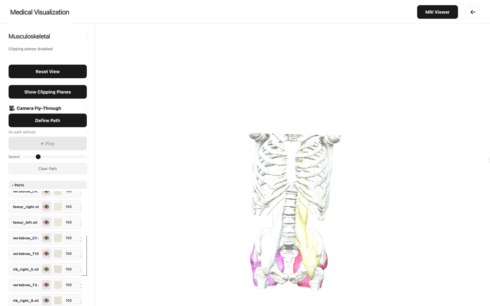
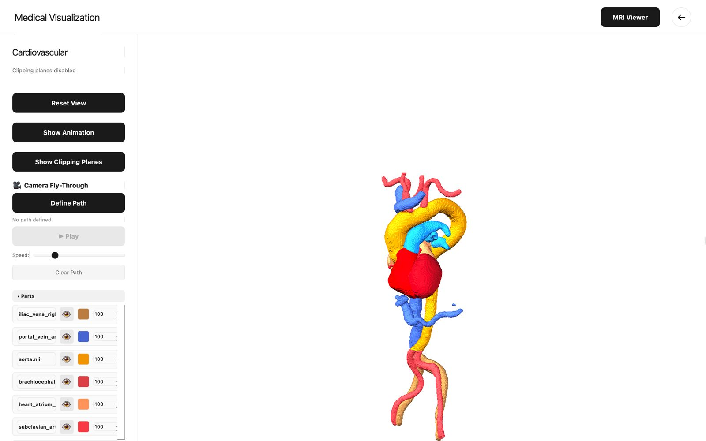
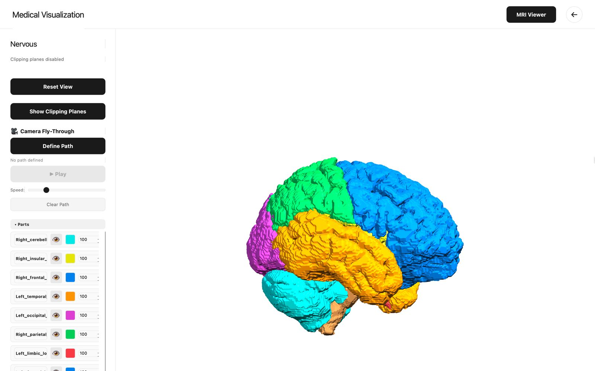

# Medical Visualization System 
**A Medical imaging visualization application built with Python, VTK, and PyQt5 for interactive 3D visualization and Multi-Planar Reconstruction (MPR) of anatomical structures from NIfTI and STL files.**

___

# Overview
This comprehensive medical visualization system provides two main components:

- 3D Anatomical Viewer: Interactive 3D visualization of anatomical structures with advanced features like clipping planes, camera fly-through, and animation support.
-  MRI/MPR Viewer: Multi-planar reconstruction viewer with support for axial, coronal, sagittal views, and curved/panoramic MPR.
  
---

# Features
3D Visualization 
Core Functionality

### • **Multi-System Support:**


___
### • **Surface Rendering:**

<p align="center">
  
  
  <br>
  
  
</p>

___
### • **MRI Viewer (Curved MPR)**
 
**Curved MPR View**: Custom curved reconstructions

Click-to-define curved path on axial view
Z-slicing along the curve
Real-time interpolation
Display Options:
Full-height curved reconstruction
Dental arch visualization


---
### • **Focus navigation:**


___

### • **Heart Animation:**

Real-time cardiac cycle visualization
STL frame sequence support
30 FPS playback with parallel loading


---

### • **Clipping Planes:**

Three anatomical planes (Sagittal, Coronal, Axial)
Real-time cross-sectional views
Visual plane indicators (red, green, blue)
Independent plane control with sliders


___
### • **Camera Fly-Through:**

Interactive path definition by clicking
Smooth interpolated camera movement
Adjustable speed control
Loop playback

### Advanced Features

- Smart Caching System:

NumPy-based compressed caching
10x faster subsequent loads
Automatic cache invalidation
~100MB cache for typical datasets


- Anatomical Color Schemes:

System-specific color palettes
Automatic structure identification
Customizable colors per part
Professional medical visualization standards


- Interactive Controls:

Individual part opacity control (0-100%)
Color picker for each structure
Focus mode (isolate specific parts)
Reset camera view


- Cinematic Lighting:

Multi-light setup for depth perception
Phong shading with specular highlights
Professional medical visualization quality
___

# Installation and Usage

1. Clone this repository:

   ```bash
   git clone https://github.com/rahmashraf/3D_Medical_Visualization.git
   ```
2. Install all required libraries, run:

   ```bash
  pip install vtk PyQt5 numpy nibabel scikit-image scipy SimpleITK matplotlib 
   ```
##  Project Structure
The following files and folders are essential for the **Medical Visualization** application to run correctly.  
If any of them are missing, the program may fail to start or show errors.  
Please make sure your project structure matches the following:
medical-visualization/
│
├── medical_visualization.py    # Main 3D viewer application
├── mri_viewer.py               # MPR viewer component
├── camera_flythrough.py        # Camera animation utilities
├── README.md                   # This file
│
├── Dataset/                    # Data folder (not in repo)
│   ├── brain/                  # NIfTI brain files
│   ├── heart/                  # NIfTI heart files
│   ├── bones/                  # NIfTI bone files
│   ├── Teeth/                  # NIfTI dental files
│   └── heartmv/                # STL animation frames
│
├── Downloads/                  # Icon files (optional)
│   ├── brain_icon.png
│   ├── heart_icon.png
│   ├── bone_icon.png
│   └── tooth_icon.png
│
└── ~/.medical_viz_cache/       # Auto-generated cache


